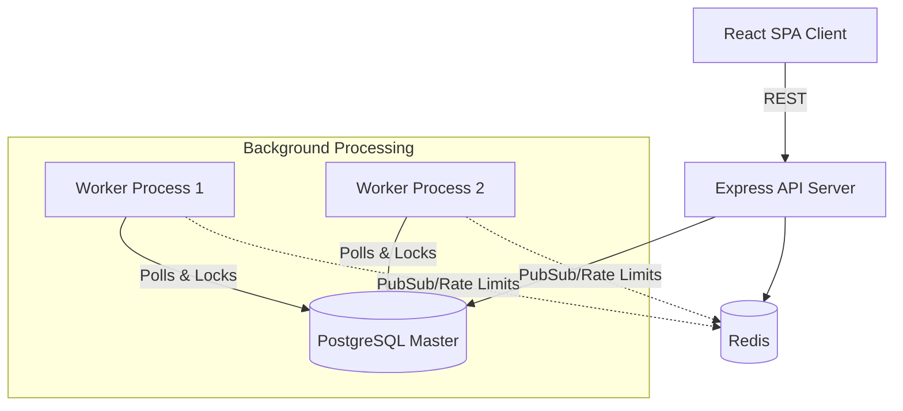
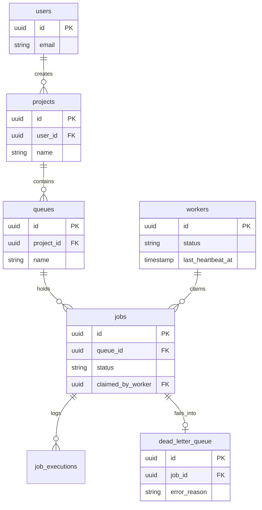

# Codity.ai - Distributed Job Scheduling Platform

A production-inspired distributed job scheduling platform capable of reliably executing asynchronous background jobs across multiple workers. Built with Node.js, Express, PostgreSQL, Redis, and React.

## Features

- **Queue Management**: Prioritization, concurrency limits, pause/resume.
- **Job Types**: Immediate, delayed, scheduled (cron), and batch jobs.
- **Atomic Claiming**: Uses PostgreSQL `SELECT FOR UPDATE SKIP LOCKED` for zero-contention atomic claiming.
- **Worker Isolation**: Separate worker processes that poll queues and send heartbeats.
- **Reliability**: Configurable retry strategies (fixed, linear, exponential backoff) and Dead Letter Queue (DLQ).
- **Dashboard**: Real-time React dashboard with WebSocket updates.

## 100% Free Deployment Architecture

To host this entire distributed system for free, use the following stack:
1. **Frontend**: [Vercel](https://vercel.com/) (Deploy the `client` directory).
2. **Databases**: 
   - PostgreSQL: [Supabase](https://supabase.com/) or [Neon.tech](https://neon.tech/)
   - Redis: [Upstash](https://upstash.com/)
3. **Compute**: [Render](https://render.com/)
   - Simply connect your GitHub repository to Render and it will automatically detect the `render.yaml` Blueprint file to spin up both the API Server and the Background Worker! You just need to paste in the `DATABASE_URL` and `REDIS_URL` in the Render dashboard.

## Prerequisites

- Node.js 20+
- Docker and Docker Compose

## Quick Start

1. **Start the Infrastructure (PostgreSQL & Redis)**
   ```bash
   docker-compose up -d
   ```

2. **Install Dependencies**
   ```bash
   npm run install:all # (if implemented) or manually:
   cd server && npm install
   cd ../worker && npm install
   cd ../client && npm install
   ```

3. **Run Migrations & Seeds**
   ```bash
   cd server
   npm run migrate
   npm run seed
   ```

4. **Start the Services**
   Open three separate terminals:
   
   **Terminal 1 (API Server)**
   ```bash
   cd server
   npm run dev
   ```
   
   **Terminal 2 (Worker)**
   ```bash
   cd worker
   npm run dev
   ```
   
   **Terminal 3 (Dashboard)**
   ```bash
   cd client
   npm run dev
   ```

## Default Credentials
The seed script creates the following user:
- Email: `admin@codity.ai`
- Password: `password123`

## API Documentation
Once the server is running, visit [http://localhost:3000/api-docs](http://localhost:3000/api-docs) for the Swagger OpenAPI documentation.

## Architecture

The platform is designed as a distributed, loosely-coupled system separating the API and background workers.



## Database Design



See `docs/design_decisions.md` for detailed system designs and architectural trade-offs.
