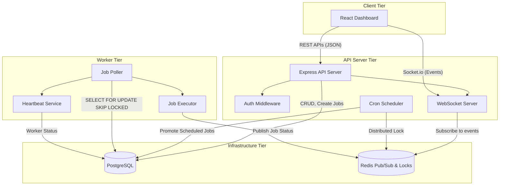

# Architecture Diagram

This document illustrates the high-level system architecture of the Codity.ai Distributed Job Scheduling Platform.

## Components Description

- **Client (React)**: Consumes REST APIs and maintains a WebSocket connection for live UI updates.
- **API Server (Express)**: Handles job creation, queue management, authentication, and serves as a WebSocket hub. Contains a background `SchedulerService` that uses a Redis lock to run exclusively on one instance to promote cron jobs into actual `jobs`.
- **Worker (Node.js)**: A lightweight, horizontally scalable polling engine that atomically claims jobs from PostgreSQL using `SELECT FOR UPDATE SKIP LOCKED`, executes them via a pluggable `Executor`, and publishes status events to Redis. It also maintains a heartbeat loop.
- **PostgreSQL**: The source of truth for all state, including organizations, users, queues, jobs, executions, and dead letter queues. Handles the concurrency control mechanism.
- **Redis**: Acts as an ephemeral message broker (Pub/Sub) for real-time WebSocket events and provides distributed locking primitives for the Scheduler.
