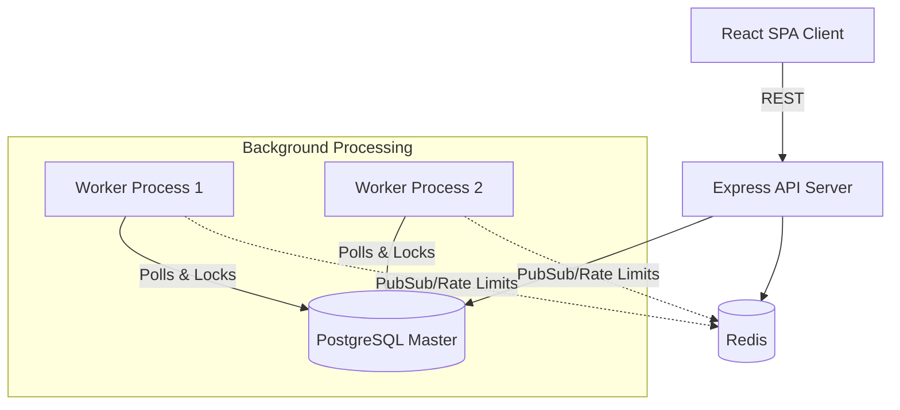
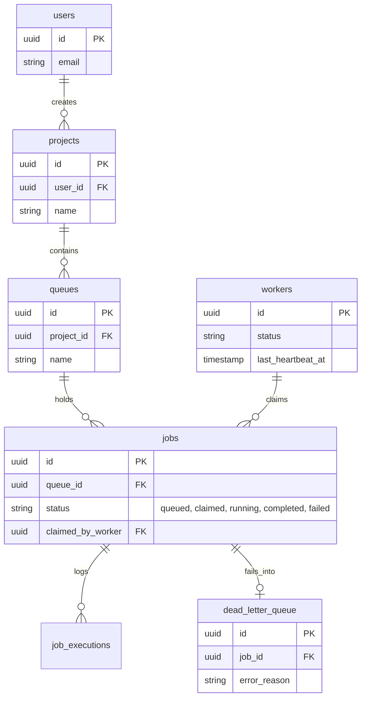

# Architecture and Design Decisions

This document outlines the core architectural choices, database design, and trade-offs made while building the Codity Job Scheduler.

## 1. System Architecture

The platform is designed as a distributed, loosely-coupled system separating the API and background workers.

### Architectural Trade-offs
- **Monorepo vs Polyrepo:** A monorepo structure (`client`, `server`, `worker`) was chosen for ease of development, shared configuration, and unified CI/CD (using workspaces).
- **Separation of API and Worker:** By splitting the API server and the Worker process, the system can scale independently. If queue depth increases, we can spin up more Worker nodes without wasting resources scaling the API servers.

## 2. Database Design & Concurrency Control

### Major Trade-off: PostgreSQL vs Redis for Job Queues

Most lightweight job schedulers (like BullMQ) use Redis for storing queues. We chose **PostgreSQL** for the following reasons:
1. **Durability & Transactional Guarantees:** We needed strict guarantees that jobs wouldn't be lost during crashes. PostgreSQL provides ACID compliance out of the box.
2. **Atomic Locking (`SKIP LOCKED`):** PostgreSQL 9.5+ allows `SELECT ... FOR UPDATE SKIP LOCKED`. This enables multiple distributed workers to safely poll the exact same queue concurrently. If Worker A locks Job 1, Worker B instantly skips it and locks Job 2. This completely eliminates race conditions without needing a complex external lock manager.
3. **Complex Queries & History:** Building the dashboard required complex aggregation (e.g., historical throughput, error rates, queue statistics). Doing this in Redis is painful, but trivial in SQL.

### Primary Keys and Normalization
- **UUIDv4 Primary Keys:** All tables use UUIDs instead of auto-incrementing integers. This prevents ID enumeration attacks (security) and prevents key collisions when workers dynamically generate jobs or logs in a truly distributed setup.
- **Foreign Key Cascading:** `ON DELETE CASCADE` is used heavily (e.g., deleting a Project deletes its Queues, which deletes its Jobs). This enforces referential integrity automatically at the database level.
- **Partial Indexes:** We use partial indexes (`WHERE status = 'queued'`) to ensure the `SKIP LOCKED` polling query is blazingly fast, even if the `jobs` table grows to hundreds of millions of completed jobs.

## 3. Reliability & Stale Worker Recovery

To prevent jobs from being permanently stuck in a `running` state if a worker node suffers a hard crash (e.g., OOM kill, power loss), the system implements a Heartbeat pattern.
- Workers update their `last_heartbeat_at` timestamp in the database every 10 seconds.
- A "recovery process" routinely scans for workers whose heartbeat is older than 30 seconds.
- Stale workers are marked `offline`, and any jobs assigned to them are atomically moved back to `queued` so another healthy worker can process them.
