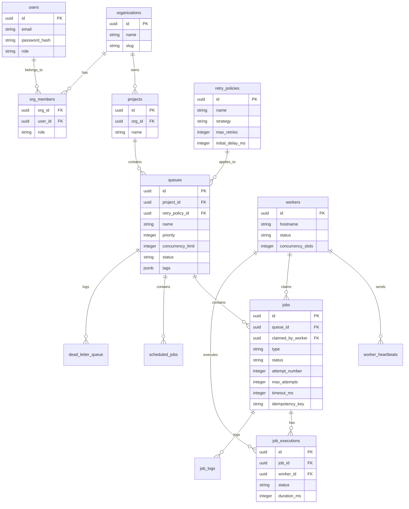

# Entity Relationship Diagram

This document describes the database schema of the Codity.ai Distributed Job Scheduling Platform.

```mermaid
erDiagram
    organizations ||--o{ projects : owns
    organizations ||--o{ org_members : has
    users ||--o{ org_members : belongs_to
    
    projects ||--o{ queues : contains
    
    retry_policies ||--o{ queues : applies_to
    
    queues ||--o{ jobs : contains
    queues ||--o{ scheduled_jobs : contains
    queues ||--o{ dead_letter_queue : logs
    
    jobs ||--o{ job_executions : has
    jobs ||--o{ job_logs : logs
    
    workers ||--o{ worker_heartbeats : sends
    workers ||--o{ jobs : claims
    workers ||--o{ job_executions : executes

    organizations {
        uuid id PK
        string name
        string slug
    }

    users {
        uuid id PK
        string email
        string password_hash
        string role
    }

    org_members {
        uuid org_id FK
        uuid user_id FK
        string role
    }

    projects {
        uuid id PK
        uuid org_id FK
        string name
    }

    retry_policies {
        uuid id PK
        string name
        string strategy
        integer max_retries
        integer initial_delay_ms
    }

    queues {
        uuid id PK
        uuid project_id FK
        uuid retry_policy_id FK
        string name
        integer priority
        integer concurrency_limit
        string status
        jsonb tags
    }

    jobs {
        uuid id PK
        uuid queue_id FK
        uuid claimed_by_worker FK
        string type
        string status
        integer attempt_number
        integer max_attempts
        integer timeout_ms
        string idempotency_key
    }

    job_executions {
        uuid id PK
        uuid job_id FK
        uuid worker_id FK
        string status
        integer duration_ms
    }

    workers {
        uuid id PK
        string hostname
        string status
        integer concurrency_slots
    }
```
