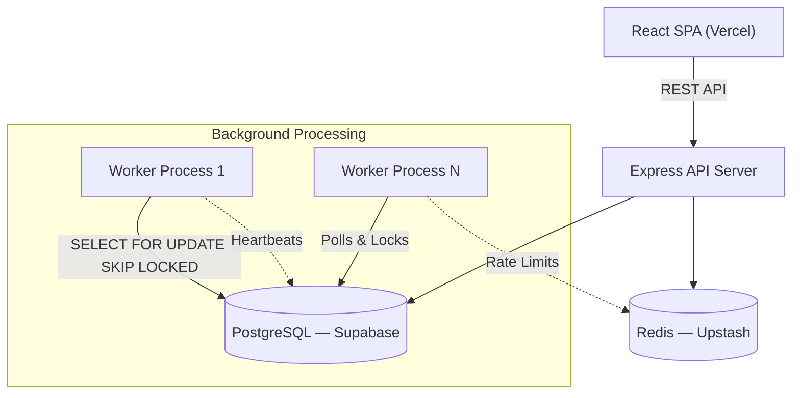
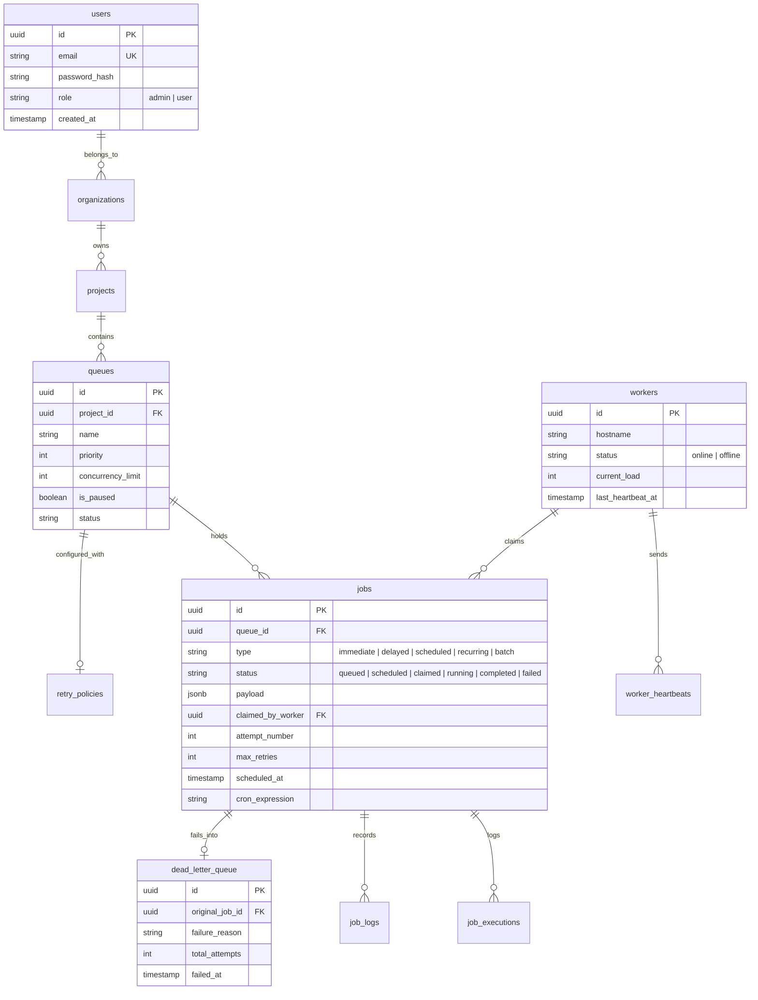

# Codity.ai — Distributed Job Scheduling Platform
### Technical Documentation & Design Report

---

## 1. Project Overview

Codity.ai is a production-inspired, distributed job scheduling platform capable of reliably executing asynchronous background jobs across multiple workers. The system is designed to handle real-world concurrency challenges, ensure job delivery guarantees, and provide full observability through a premium analytics dashboard.

**Tech Stack:** Node.js · Express · PostgreSQL · Redis · React · Recharts · Framer Motion · Docker

---

## 2. System Architecture

The platform follows a decoupled, horizontally-scalable architecture with three distinct layers:



| Layer | Responsibility | Scaling Strategy |
|-------|---------------|-----------------|
| **Client** | Dashboard, Queue/Job management UI | CDN (Vercel) |
| **API Server** | REST endpoints, auth, validation, scheduling | Horizontal (stateless) |
| **Worker** | Polls queues, claims jobs, executes, sends heartbeats | Horizontal (add more nodes) |
| **PostgreSQL** | Source of truth for all state, atomic locking | Vertical / Read replicas |
| **Redis** | Session caching, rate limiting, pub/sub | Cluster mode |

---

## 3. Database Design (ER Diagram)



### Key Database Design Decisions

| Decision | Rationale |
|----------|-----------|
| **UUIDv4 Primary Keys** | Prevents ID enumeration attacks; no collisions across distributed workers |
| **Partial Indexes** (`WHERE status = 'queued'`) | Dramatically speeds up the worker polling query even with millions of historical rows |
| **`ON DELETE CASCADE`** | Enforces referential integrity automatically (Project → Queues → Jobs) |
| **JSONB for payloads** | Flexible schema for arbitrary job data without schema migrations |

---

## 4. Concurrency & Reliability

### Atomic Job Claiming (Zero Race Conditions)
The most critical engineering challenge is preventing two workers from executing the same job. We solve this using PostgreSQL's `SELECT ... FOR UPDATE SKIP LOCKED`:

```sql
SELECT id FROM jobs
WHERE queue_id = $1 AND status = 'queued'
ORDER BY priority DESC, created_at ASC
LIMIT 1
FOR UPDATE SKIP LOCKED;
```

This query atomically locks exactly one unclaimed job per worker. If Worker A locks Job 1, Worker B instantly skips it and grabs Job 2. No external lock manager (like Redis Redlock) is needed.

### Stale Worker Recovery (Heartbeat Pattern)
Workers send heartbeats every **10 seconds** by updating their `last_heartbeat_at` timestamp. A recovery process scans for workers whose heartbeat is older than **30 seconds**, marks them `offline`, and atomically re-queues any orphaned jobs back to `queued` status.

### Retry Strategies & Dead Letter Queue
Failed jobs are retried using configurable backoff strategies:

| Strategy | Delay Formula | Use Case |
|----------|--------------|----------|
| **Fixed** | `delay` ms | Simple, predictable retries |
| **Linear** | `delay × attempt` | Gradual increase |
| **Exponential** | `delay × 2^attempt` | External API rate limits |

After exhausting all retries, jobs are permanently moved to the **Dead Letter Queue (DLQ)** with full error context for manual inspection and retry.

---

## 5. API Design

All endpoints follow RESTful conventions with JWT authentication, input validation (Joi), pagination, and structured error responses.

| Endpoint Group | Methods | Description |
|---------------|---------|-------------|
| `/api/auth` | POST | Register, login, token refresh |
| `/api/queues` | GET, POST, PUT, DELETE | CRUD for job queues |
| `/api/jobs` | GET, POST | Create and inspect jobs |
| `/api/workers` | GET | Monitor worker fleet |
| `/api/dlq` | GET, POST | Inspect and retry dead-lettered jobs |
| `/api/metrics` | GET | Throughput, error rates, system overview |
| `/api/simulate` | POST | Launch burst simulations for testing |

Full interactive documentation available at `/api-docs` (Swagger/OpenAPI).

---

## 6. Frontend & Dashboard

The dashboard is a premium, SaaS-grade analytics console built with **React**, **Recharts**, and **Framer Motion**.

### Key Features
- **Real-time Stat Cards** — Animated number counters with sparkline mini-charts
- **Throughput & Error Volume Charts** — Smooth monotone curves with gradient fills and glow effects
- **Live Activity Feed** — Relative timestamps, status badges, pulsing live indicator
- **Queue Management** — Card-based grid with pause/resume, priority controls
- **Job Explorer** — Filterable data table with status badges and execution details
- **Worker Monitor** — Live heartbeat status and load indicators
- **Dead Letter Queue** — Inspect failures and retry with one click
- **Launch Simulation** — Deploy burst jobs to test system under load

### Design Philosophy
The UI follows a **glassmorphism** aesthetic with layered card elevations (diffused shadows + inset highlights), a radial glow background, and smooth `framer-motion` page transitions. The goal was to match the visual quality of Vercel, Linear, and Stripe dashboards.

---

## 7. Testing

| Suite | Tests | Coverage |
|-------|-------|----------|
| **Server — Pagination Utils** | 13 tests | Edge cases, defaults, boundaries |
| **Server — Error Handling** | 8 tests | All custom error classes |
| **Server — Validation Middleware** | 8 tests | Joi schema integration |
| **Server — Retry Service** | 4 tests | All backoff strategies |
| **Worker — Simulation Handler** | 4 tests | Success, failure, abort signals |
| **Total** | **37 tests passing** | ✅ |

---

## 8. Deployment Architecture (100% Free)

| Service | Provider | Cost |
|---------|----------|------|
| **Frontend (React SPA)** | Vercel | Free |
| **Backend (API + Worker)** | Render (Docker) | Free |
| **PostgreSQL Database** | Supabase | Free |
| **Redis Cache** | Upstash | Free |

The backend uses a single `Dockerfile` with a `start.sh` entrypoint script that runs both the Express API server and the background worker process inside the same container, maximizing free-tier resource utilization.

---

## 9. Project Structure

```
codity.ai-assignment/
├── client/                  # React frontend (Vite)
│   ├── src/
│   │   ├── components/      # Reusable UI components
│   │   ├── pages/           # Dashboard, Jobs, Queues, Workers, DLQ
│   │   ├── contexts/        # Auth context
│   │   └── hooks/           # WebSocket hook
├── server/                  # Express API server
│   ├── migrations/          # 14 Knex migration files
│   ├── seeds/               # Demo data seeder
│   └── src/
│       ├── controllers/     # Route handlers
│       ├── services/        # Business logic
│       ├── middleware/       # Auth, validation, error handling
│       └── routes/          # REST API routes
├── worker/                  # Background job processor
│   └── src/
│       ├── poller.js        # Queue polling with SKIP LOCKED
│       ├── executor.js      # Concurrent job execution
│       ├── heartbeat.js     # Worker health monitoring
│       └── gracefulShutdown.js
├── docs/                    # Architecture & design documents
├── Dockerfile               # Combined server + worker container
├── docker-compose.yml       # Local development infrastructure
└── start.sh                 # Container entrypoint
```
