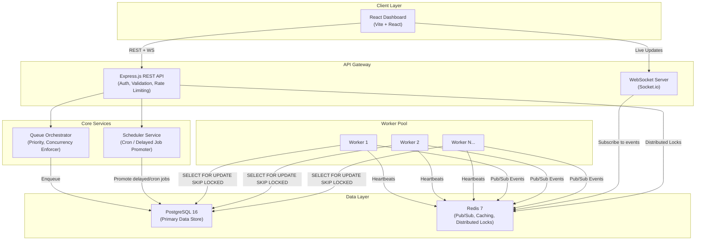
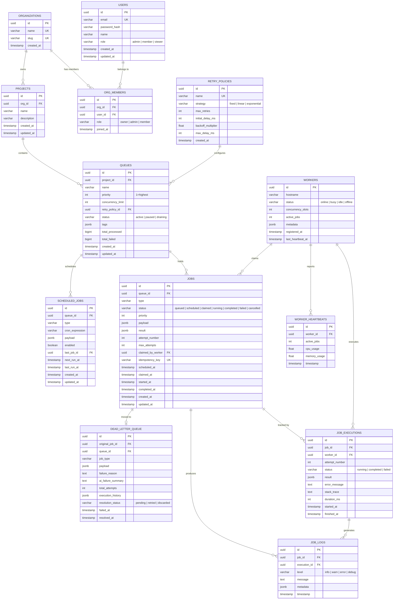
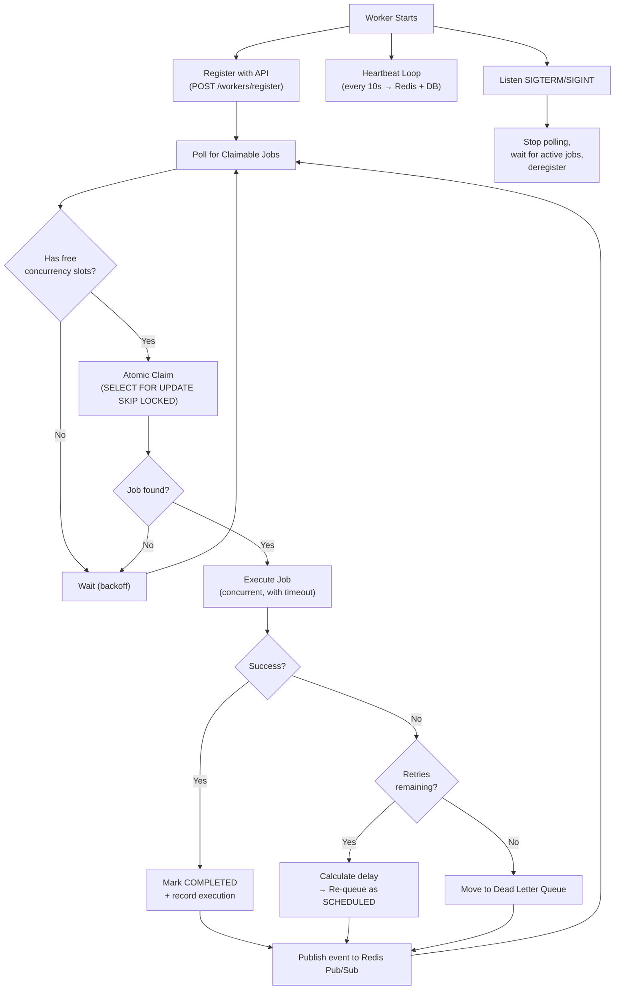

# Codity.ai — Distributed Job Scheduling Platform

> **Goal**: Design and build a production-inspired distributed job scheduling platform capable of reliably executing asynchronous background jobs across multiple workers.

## Table of Contents
- [System Architecture](#system-architecture)
- [Technology Stack](#technology-stack)
- [Project Structure](#project-structure)
- [Database Design](#database-design)
- [Backend Engineering](#backend-engineering)
- [Worker Service](#worker-service)
- [Frontend Dashboard](#frontend-dashboard)
- [Bonus Features](#bonus-features)
- [Deliverables](#deliverables)
- [Verification Plan](#verification-plan)
- [Execution Phases](#execution-phases)

---

## System Architecture



### Architectural Decisions

| Decision | Choice | Rationale |
|---|---|---|
| **Job State Store** | PostgreSQL | ACID guarantees, `SELECT FOR UPDATE SKIP LOCKED` for atomic claiming, rich query support for the dashboard |
| **Pub/Sub & Caching** | Redis | Low-latency event propagation to WebSocket clients, worker heartbeat TTL keys, distributed locking via Redlock |
| **Atomic Job Claiming** | `SELECT FOR UPDATE SKIP LOCKED` | Database-native, crash-safe (auto-rollback), no external dependencies |
| **Worker Model** | Separate Node.js processes | Isolated from API server, horizontally scalable, graceful shutdown via SIGTERM |
| **Real-time Updates** | Socket.io over Redis Pub/Sub | Workers publish events → Redis → Socket.io server → Dashboard |
| **Authentication** | JWT (access + refresh tokens) | Stateless, scalable, industry standard |
| **API Framework** | Express.js | Mature, battle-tested, rich middleware ecosystem |
| **Frontend** | React (Vite) | Fast dev experience, component-driven, excellent charting libraries |

---

## Technology Stack

### Backend
| Layer | Technology |
|---|---|
| Runtime | Node.js 20 LTS |
| Framework | Express.js 4.x |
| Database | PostgreSQL 16 |
| Cache / Pub/Sub | Redis 7 |
| ORM / Query Builder | Knex.js (migrations + query builder) |
| Auth | JWT (`jsonwebtoken`) + `bcryptjs` |
| Validation | Joi |
| Scheduling | `node-cron` (cron expression parsing) + custom scheduler loop |
| WebSocket | Socket.io |
| Logging | Winston |
| Testing | Jest + Supertest |
| API Docs | Swagger (swagger-jsdoc + swagger-ui-express) |

### Frontend
| Layer | Technology |
|---|---|
| Framework | React 18 (Vite) |
| Routing | React Router v6 |
| State | React Query (TanStack Query) |
| Charts | Recharts |
| UI Components | Custom CSS + Lucide Icons |
| WebSocket Client | socket.io-client |

### Infrastructure
| Layer | Technology |
|---|---|
| Containerization | Docker + docker-compose |
| Process Management | Node.js cluster / PM2 (for workers) |

---

## Project Structure

```
Codity.ai/
├── docker-compose.yml
├── package.json                    # Root workspace
├── README.md
├── docs/
│   ├── architecture-diagram.md     # Mermaid architecture diagram
│   ├── er-diagram.md               # Mermaid ER diagram
│   ├── api-documentation.md        # Full API reference
│   └── design-decisions.md         # Trade-offs & rationale
│
├── server/                         # Backend monorepo package
│   ├── package.json
│   ├── knexfile.js                 # Knex configuration
│   ├── src/
│   │   ├── index.js                # Express app entry point
│   │   ├── config/
│   │   │   ├── database.js         # PG connection pool
│   │   │   ├── redis.js            # Redis client
│   │   │   └── env.js              # Environment config
│   │   ├── middleware/
│   │   │   ├── auth.js             # JWT verification
│   │   │   ├── rbac.js             # Role-based access control
│   │   │   ├── validate.js         # Joi validation middleware
│   │   │   ├── rateLimiter.js      # API rate limiting
│   │   │   └── errorHandler.js     # Centralized error handling
│   │   ├── routes/
│   │   │   ├── auth.routes.js
│   │   │   ├── org.routes.js
│   │   │   ├── project.routes.js
│   │   │   ├── queue.routes.js
│   │   │   ├── job.routes.js
│   │   │   ├── worker.routes.js
│   │   │   └── metrics.routes.js
│   │   ├── controllers/
│   │   │   ├── auth.controller.js
│   │   │   ├── org.controller.js
│   │   │   ├── project.controller.js
│   │   │   ├── queue.controller.js
│   │   │   ├── job.controller.js
│   │   │   ├── worker.controller.js
│   │   │   └── metrics.controller.js
│   │   ├── services/
│   │   │   ├── auth.service.js
│   │   │   ├── queue.service.js
│   │   │   ├── job.service.js
│   │   │   ├── scheduler.service.js  # Cron / delayed job promoter
│   │   │   ├── dlq.service.js        # Dead Letter Queue logic
│   │   │   ├── retry.service.js      # Retry strategy calculator
│   │   │   └── metrics.service.js    # Aggregation queries
│   │   ├── models/                   # Knex query helpers per table
│   │   │   ├── user.model.js
│   │   │   ├── organization.model.js
│   │   │   ├── project.model.js
│   │   │   ├── queue.model.js
│   │   │   ├── job.model.js
│   │   │   ├── jobExecution.model.js
│   │   │   ├── worker.model.js
│   │   │   └── dlq.model.js
│   │   ├── websocket/
│   │   │   └── socketServer.js     # Socket.io setup + Redis adapter
│   │   └── utils/
│   │       ├── logger.js           # Winston logger
│   │       ├── errors.js           # Custom error classes
│   │       └── pagination.js       # Cursor/offset pagination helper
│   ├── migrations/                 # Knex migrations
│   │   ├── 001_create_users.js
│   │   ├── 002_create_organizations.js
│   │   ├── 003_create_projects.js
│   │   ├── 004_create_retry_policies.js
│   │   ├── 005_create_queues.js
│   │   ├── 006_create_jobs.js
│   │   ├── 007_create_job_executions.js
│   │   ├── 008_create_workers.js
│   │   ├── 009_create_worker_heartbeats.js
│   │   ├── 010_create_job_logs.js
│   │   ├── 011_create_scheduled_jobs.js
│   │   └── 012_create_dead_letter_queue.js
│   ├── seeds/                      # Seed data for development
│   │   └── 001_demo_data.js
│   └── tests/
│       ├── unit/
│       │   ├── retry.service.test.js
│       │   ├── scheduler.service.test.js
│       │   └── job.service.test.js
│       └── integration/
│           ├── auth.test.js
│           ├── queue.test.js
│           ├── job.test.js
│           └── worker.test.js
│
├── worker/                         # Worker service (separate process)
│   ├── package.json
│   ├── src/
│   │   ├── index.js                # Worker entry point
│   │   ├── poller.js               # Queue polling loop
│   │   ├── executor.js             # Job execution engine
│   │   ├── heartbeat.js            # Heartbeat sender
│   │   ├── handlers/               # Pluggable job type handlers
│   │   │   ├── httpRequest.js
│   │   │   ├── shellCommand.js
│   │   │   └── simulation.js       # Simulated workloads for demo
│   │   └── gracefulShutdown.js     # SIGTERM / SIGINT handler
│   └── tests/
│       ├── poller.test.js
│       └── executor.test.js
│
└── client/                         # React dashboard
    ├── package.json
    ├── vite.config.js
    ├── index.html
    ├── public/
    └── src/
        ├── main.jsx
        ├── App.jsx
        ├── index.css               # Global design system
        ├── api/
        │   ├── client.js           # Axios instance + interceptors
        │   └── endpoints.js        # API endpoint constants
        ├── hooks/
        │   ├── useAuth.js
        │   ├── useWebSocket.js
        │   └── useQueues.js
        ├── contexts/
        │   └── AuthContext.jsx
        ├── pages/
        │   ├── Login.jsx
        │   ├── Dashboard.jsx       # Overview / system health
        │   ├── Queues.jsx          # Queue list + config
        │   ├── QueueDetail.jsx     # Single queue deep-dive
        │   ├── Jobs.jsx            # Job explorer
        │   ├── JobDetail.jsx       # Single job + execution history
        │   ├── Workers.jsx         # Worker status grid
        │   └── DLQ.jsx             # Dead Letter Queue viewer
        ├── components/
        │   ├── Layout/
        │   │   ├── Sidebar.jsx
        │   │   ├── Header.jsx
        │   │   └── Layout.jsx
        │   ├── Charts/
        │   │   ├── ThroughputChart.jsx
        │   │   ├── JobStatusPie.jsx
        │   │   └── WorkerHealthGrid.jsx
        │   ├── Tables/
        │   │   ├── DataTable.jsx
        │   │   └── Pagination.jsx
        │   ├── Modals/
        │   │   ├── CreateJobModal.jsx
        │   │   ├── QueueConfigModal.jsx
        │   │   └── RetryJobModal.jsx
        │   └── StatusBadge.jsx
        └── utils/
            ├── formatters.js
            └── constants.js
```

---

## Database Design

### ER Diagram



### Schema Design Rationale

#### Primary Keys
- All tables use **UUID v4** (`gen_random_uuid()`) primary keys for:
  - Distributed ID generation (no central sequence coordination)
  - Security (non-guessable, non-enumerable)
  - Merge-safe across environments

#### Critical Indexes

```sql
-- Job claiming: The most performance-critical query
CREATE INDEX idx_jobs_claimable ON jobs (queue_id, priority, created_at)
    WHERE status = 'queued' AND scheduled_at <= NOW();

-- Job status filtering (dashboard queries)
CREATE INDEX idx_jobs_status ON jobs (status, queue_id);

-- Worker heartbeat timeout detection
CREATE INDEX idx_workers_heartbeat ON workers (last_heartbeat_at)
    WHERE status IN ('online', 'busy');

-- Scheduled job promotion
CREATE INDEX idx_scheduled_next_run ON scheduled_jobs (next_run_at)
    WHERE enabled = true;

-- DLQ browsing
CREATE INDEX idx_dlq_resolution ON dead_letter_queue (resolution_status, failed_at);

-- Idempotency key uniqueness (per queue)
CREATE UNIQUE INDEX idx_jobs_idempotency ON jobs (queue_id, idempotency_key)
    WHERE idempotency_key IS NOT NULL;

-- Execution history per job
CREATE INDEX idx_executions_job ON job_executions (job_id, attempt_number);
```

#### Normalization
- **3NF**: All tables are in third normal form. Retry policies are a separate table to avoid JSONB duplication across queues.
- **Denormalized counters**: `queues.total_processed` and `queues.total_failed` are denormalized counters updated atomically with job state transitions to avoid expensive `COUNT(*)` aggregations on the dashboard.
- **JSONB fields**: Used selectively for flexible schemas (`payload`, `result`, `metadata`, `tags`) that vary per job type.

#### Cascading Behavior
| Relationship | ON DELETE |
|---|---|
| Organization → Projects | CASCADE |
| Project → Queues | CASCADE |
| Queue → Jobs | CASCADE |
| Job → Job Executions | CASCADE |
| Job → Job Logs | CASCADE |
| Job → DLQ Entry | SET NULL (preserve DLQ) |
| Worker → Heartbeats | CASCADE |
| Retry Policy → Queues | RESTRICT (prevent orphan) |
| Org Member → Users/Orgs | CASCADE |

#### Performance Considerations
1. **Partial indexes** on `status = 'queued'` dramatically reduce the claimable job search space
2. **`SELECT FOR UPDATE SKIP LOCKED`** ensures zero-contention atomic claiming
3. **Table partitioning** (future): `job_executions` can be range-partitioned by `started_at` for archival
4. **Connection pooling**: Knex pool config with `min: 2, max: 20` to prevent pool exhaustion during peak worker activity
5. **Separate read replica** (future): Dashboard queries can target a read replica to isolate OLTP from analytics

---

## Backend Engineering

### Authentication & RBAC

#### Auth Flow
```
POST /api/auth/register   → Create user + hash password (bcrypt, 12 rounds)
POST /api/auth/login       → Verify credentials → Issue JWT (access: 15m, refresh: 7d)
POST /api/auth/refresh     → Rotate access token
POST /api/auth/logout      → Blacklist refresh token in Redis
```

#### Role-Based Access Control (Bonus)
```
Organization Roles:
  owner  → Full CRUD on org, projects, queues, jobs, members
  admin  → Full CRUD on projects, queues, jobs; manage members
  member → Read all; create/manage own jobs

Global Roles:
  admin  → Platform-wide superuser
  viewer → Read-only access
```

RBAC middleware checks: `req.user.orgRole` against required permission for each route.

### REST API Surface

#### Queue Management
```
POST   /api/projects/:projectId/queues          Create queue
GET    /api/projects/:projectId/queues          List queues (paginated, filterable)
GET    /api/queues/:queueId                     Get queue details + stats
PATCH  /api/queues/:queueId                     Update queue config
DELETE /api/queues/:queueId                     Delete queue (cascade or drain)
POST   /api/queues/:queueId/pause               Pause queue
POST   /api/queues/:queueId/resume              Resume queue
GET    /api/queues/:queueId/stats               Queue statistics & metrics
```

#### Job Management
```
POST   /api/queues/:queueId/jobs                Create job (immediate)
POST   /api/queues/:queueId/jobs/delayed        Create delayed job (run at timestamp)
POST   /api/queues/:queueId/jobs/scheduled      Create recurring/cron job
POST   /api/queues/:queueId/jobs/batch          Create batch of jobs
GET    /api/queues/:queueId/jobs                List jobs (paginated, filterable by status)
GET    /api/jobs/:jobId                         Get job detail + execution history
DELETE /api/jobs/:jobId                         Cancel job
POST   /api/jobs/:jobId/retry                   Retry failed job
GET    /api/jobs/:jobId/logs                    Get execution logs
```

#### Worker Management
```
POST   /api/workers/register                   Worker self-registration
GET    /api/workers                             List all workers + status
GET    /api/workers/:workerId                   Worker detail + active jobs
DELETE /api/workers/:workerId                   Deregister worker
```

#### Dead Letter Queue
```
GET    /api/queues/:queueId/dlq                 List DLQ entries
POST   /api/dlq/:entryId/retry                  Retry DLQ entry
POST   /api/dlq/:entryId/discard                Discard DLQ entry
```

#### Metrics
```
GET    /api/metrics/throughput                  Jobs processed per minute/hour
GET    /api/metrics/error-rate                  Failure rate over time
GET    /api/metrics/workers                     Worker utilization metrics
GET    /api/metrics/queues                      Per-queue performance summary
```

### Request/Response Standards

```javascript
// Success Response
{
  "success": true,
  "data": { ... },
  "meta": {
    "page": 1,
    "limit": 20,
    "total": 150,
    "totalPages": 8
  }
}

// Error Response
{
  "success": false,
  "error": {
    "code": "QUEUE_NOT_FOUND",
    "message": "Queue with ID abc-123 not found",
    "statusCode": 404,
    "details": {}
  }
}
```

### Validation Schema Examples (Joi)

```javascript
// Create Job
{
  type: Joi.string().required().max(100),
  payload: Joi.object().required(),
  priority: Joi.number().integer().min(1).max(10).default(5),
  scheduledAt: Joi.date().iso().min('now').optional(),
  cronExpression: Joi.string().optional(),  // validated with cron-parser
  idempotencyKey: Joi.string().max(255).optional(),
  maxAttempts: Joi.number().integer().min(1).max(20).default(3),
  timeoutMs: Joi.number().integer().min(1000).max(3600000).default(30000)
}

// Queue Config
{
  name: Joi.string().required().min(1).max(100),
  priority: Joi.number().integer().min(1).max(10).default(5),
  concurrencyLimit: Joi.number().integer().min(1).max(100).default(5),
  retryPolicyId: Joi.string().uuid().optional(),
  tags: Joi.object().optional()
}
```

---

## Worker Service

### Core Worker Loop



### Atomic Job Claiming (Critical Path)

```sql
-- This is the core atomic claiming query
-- Runs inside a short transaction
BEGIN;

UPDATE jobs
SET
    status = 'claimed',
    claimed_by_worker = $1,       -- worker UUID
    claimed_at = NOW(),
    attempt_number = attempt_number + 1,
    updated_at = NOW()
WHERE id = (
    SELECT id FROM jobs
    WHERE queue_id = ANY($2)       -- worker's subscribed queues
      AND status = 'queued'
      AND scheduled_at <= NOW()
    ORDER BY priority ASC, created_at ASC
    LIMIT 1
    FOR UPDATE SKIP LOCKED
)
RETURNING *;

COMMIT;
```

> [!IMPORTANT]
> The `FOR UPDATE SKIP LOCKED` clause ensures that if two workers race for the same job, one wins atomically and the other skips to the next available job — **zero duplicate execution**.

### Retry Strategy Calculator

```javascript
// retry.service.js
function calculateDelay(policy, attemptNumber) {
    switch (policy.strategy) {
        case 'fixed':
            return policy.initial_delay_ms;

        case 'linear':
            return policy.initial_delay_ms * attemptNumber;

        case 'exponential':
            const delay = policy.initial_delay_ms *
                Math.pow(policy.backoff_multiplier, attemptNumber - 1);
            return Math.min(delay, policy.max_delay_ms);

        default:
            return policy.initial_delay_ms;
    }
}
```

### Heartbeat Mechanism

```javascript
// heartbeat.js — runs in parallel with the poll loop
async function heartbeatLoop(workerId, redis, db) {
    const INTERVAL = 10_000; // 10 seconds
    const TTL = 30;          // 30 seconds TTL in Redis

    setInterval(async () => {
        // 1. Update Redis key with TTL (for fast liveness checks)
        await redis.set(`worker:heartbeat:${workerId}`, JSON.stringify({
            activeJobs: getActiveJobCount(),
            cpu: process.cpuUsage(),
            memory: process.memoryUsage().heapUsed
        }), 'EX', TTL);

        // 2. Update PostgreSQL (for durable history)
        await db('worker_heartbeats').insert({
            worker_id: workerId,
            active_jobs: getActiveJobCount(),
            cpu_usage: getCpuPercent(),
            memory_usage: getMemoryPercent(),
            timestamp: new Date()
        });

        // 3. Update worker table
        await db('workers')
            .where({ id: workerId })
            .update({ last_heartbeat_at: new Date() });

    }, INTERVAL);
}
```

### Graceful Shutdown

```javascript
// gracefulShutdown.js
async function setupGracefulShutdown(worker) {
    const signals = ['SIGTERM', 'SIGINT'];

    for (const signal of signals) {
        process.on(signal, async () => {
            logger.info(`Received ${signal}, initiating graceful shutdown...`);

            // 1. Stop accepting new jobs
            worker.stopPolling();

            // 2. Wait for active jobs to complete (with timeout)
            await worker.drainActiveJobs(/* timeout: 30s */);

            // 3. Deregister from the platform
            await worker.deregister();

            // 4. Close connections
            await worker.cleanup();

            process.exit(0);
        });
    }
}
```

---

## Frontend Dashboard

### Page Layout & Features

#### 1. Dashboard (System Overview)
- **Throughput chart** (line chart — jobs/minute over last 24h)
- **Job status distribution** (donut chart — queued/running/completed/failed)
- **Active workers count** with health indicators (green/yellow/red)
- **Queue summary cards** with live job counts
- **Recent failures feed** (last 10 failed jobs)

#### 2. Queues Page
- **Queue list table** — name, status, priority, concurrency, processed/failed counts
- **Quick actions** — pause, resume, configure, delete
- **Create queue modal** with full config (retry policy, concurrency, tags)
- **Queue detail view** — real-time job counts by status, throughput mini-chart

#### 3. Job Explorer
- **Filterable/sortable table** — status, type, queue, priority, created_at, duration
- **Create job modal** — supports immediate, delayed, cron, and batch job creation
- **Job detail panel** — payload, result, execution timeline, retry history, logs
- **Batch actions** — retry selected, cancel selected

#### 4. Workers Page
- **Worker status grid** — cards showing hostname, status, active jobs, CPU/memory
- **Heartbeat timeline** — visual indicator of last heartbeat freshness
- **Worker detail** — list of currently active jobs, historical executions

#### 5. Dead Letter Queue
- **DLQ table** — job type, failure reason, AI summary, total attempts, age
- **Actions** — retry (sends back to queue), discard, inspect payload
- **AI failure summary** — generated explanation of why the job failed

#### 6. Metrics Page
- **Throughput over time** (line chart, configurable interval)
- **Error rate** (area chart)
- **P50/P95/P99 job duration** (box plot or line chart)
- **Queue comparison** (bar chart)
- **Worker utilization** (stacked area chart)

### Design System
- **Dark mode by default** with optional light mode
- **Color palette**: Deep slate backgrounds, vibrant accent colors (indigo/purple for primary, emerald for success, amber for warning, rose for error)
- **Typography**: Inter font family
- **Components**: Glassmorphism cards, smooth hover transitions, skeleton loaders, animated status badges
- **Responsive**: Sidebar collapses on mobile, tables become card views

### WebSocket Integration

```javascript
// useWebSocket.js hook
function useWebSocket() {
    const socket = useRef(null);

    useEffect(() => {
        socket.current = io(WS_URL, { auth: { token: getAccessToken() } });

        // Subscribe to real-time events
        socket.current.on('job:status_changed', (data) => {
            queryClient.invalidateQueries(['jobs', data.queueId]);
        });

        socket.current.on('worker:heartbeat', (data) => {
            queryClient.setQueryData(['workers'], /* update worker */);
        });

        socket.current.on('queue:stats_updated', (data) => {
            queryClient.invalidateQueries(['queues', data.queueId, 'stats']);
        });

        return () => socket.current?.disconnect();
    }, []);
}
```

---

## Bonus Features

### 1. Workflow Dependencies
Jobs can declare dependencies on other jobs:
```javascript
POST /api/queues/:queueId/jobs
{
  "type": "generate-report",
  "payload": { ... },
  "dependsOn": ["job-uuid-1", "job-uuid-2"]  // Must complete before this runs
}
```
Implementation: Add `depends_on UUID[]` column to `jobs` table. The scheduler only promotes a job to `queued` when all dependencies are `completed`.

### 2. Rate Limiting
- API-level: Express rate limiter per user/org (Redis-backed sliding window)
- Queue-level: `max_jobs_per_second` config on queues. Workers respect this via token bucket in Redis.

### 3. Distributed Locking
Redis-based Redlock for:
- Scheduler leader election (only one scheduler instance promotes cron jobs)
- Queue-level concurrency enforcement across multiple workers

### 4. Event-Driven Execution
Redis Pub/Sub channels for:
- `job:created`, `job:claimed`, `job:completed`, `job:failed`, `job:dlq`
- Workers and dashboard subscribe to relevant channels

### 5. AI-Generated Failure Summaries
When a job is moved to the DLQ, call an AI API (or use a local heuristic) to generate a human-readable summary:
```
"This HTTP request job failed after 3 attempts due to a persistent 503 Service
Unavailable response from api.example.com. The error suggests the target
service is experiencing downtime. Recommended action: check the upstream
service status and retry once it is restored."
```
Store in `dead_letter_queue.ai_failure_summary`.

---

## Deliverables

| Deliverable | Location | Status |
|---|---|---|
| **Source code** | `Codity.ai/` workspace | To implement |
| **Setup instructions** | `README.md` | To create |
| **Architecture diagram** | `docs/architecture-diagram.md` | Mermaid in this plan |
| **ER diagram** | `docs/er-diagram.md` | Mermaid in this plan |
| **API documentation** | `docs/api-documentation.md` + Swagger UI at `/api-docs` | To create |
| **Design decisions** | `docs/design-decisions.md` | To create |
| **Automated tests** | `server/tests/` + `worker/tests/` | To create |
| **Docker setup** | `docker-compose.yml` | To create |

---

## Verification Plan

### Automated Tests

```bash
# Unit tests — retry calculator, scheduler, service layer
cd server && npx jest --testPathPattern=unit

# Integration tests — full API + database flows
cd server && npx jest --testPathPattern=integration

# Worker tests — claiming, execution, heartbeat
cd worker && npx jest
```

**Test Coverage Targets:**
- Atomic job claiming (no duplicates under concurrent workers)
- Retry strategy calculations (fixed, linear, exponential)
- Job lifecycle transitions (happy path + failure path)
- DLQ promotion after max retries exhausted
- Auth + RBAC enforcement
- Queue pause/resume behavior
- Cron job scheduling and promotion

### Manual Verification
1. `docker-compose up` → all services start cleanly
2. Register user → create org → create project → create queue
3. Submit immediate, delayed, and cron jobs
4. Start 2+ worker instances → observe parallel job claiming
5. Force a job failure → observe retry with backoff → DLQ promotion
6. Pause queue → verify no new jobs are claimed
7. Dashboard shows real-time updates via WebSocket
8. Kill a worker → verify heartbeat timeout → stale jobs re-queued

---

## Execution Phases

### Phase 1: Foundation (Estimated: 2-3 days)
- [ ] Initialize monorepo (npm workspaces)
- [ ] Docker Compose (PostgreSQL + Redis)
- [ ] Knex setup + all 12 migrations
- [ ] Seed data
- [ ] Express app skeleton with middleware chain
- [ ] Auth system (register, login, JWT)

### Phase 2: Core Backend (Estimated: 3-4 days)
- [ ] Queue CRUD + pause/resume
- [ ] Job CRUD (immediate, delayed, scheduled, batch)
- [ ] Retry policy management
- [ ] Job lifecycle state machine
- [ ] DLQ service
- [ ] Metrics aggregation queries
- [ ] Swagger API documentation

### Phase 3: Worker Service (Estimated: 2-3 days)
- [ ] Worker registration & heartbeat
- [ ] Queue polling with `SELECT FOR UPDATE SKIP LOCKED`
- [ ] Concurrent job execution with timeout
- [ ] Retry with configurable backoff strategies
- [ ] DLQ promotion on permanent failure
- [ ] Graceful shutdown
- [ ] Redis Pub/Sub event publishing

### Phase 4: Frontend Dashboard (Estimated: 3-4 days)
- [ ] Vite + React project setup
- [ ] Design system (dark theme, CSS custom properties)
- [ ] Auth pages (login/register)
- [ ] Dashboard overview page (charts, stats)
- [ ] Queue management pages
- [ ] Job explorer with filters
- [ ] Worker status page
- [ ] DLQ viewer
- [ ] WebSocket integration for live updates

### Phase 5: Bonus Features & Polish (Estimated: 2-3 days)
- [ ] RBAC middleware
- [ ] Workflow dependencies
- [ ] Rate limiting (API + queue-level)
- [ ] Distributed locking (Redlock)
- [ ] AI failure summaries
- [ ] Comprehensive tests
- [ ] Documentation (architecture, ER, API, design decisions)
- [ ] README with setup instructions

> [!IMPORTANT]
> **Total estimated timeline: 12-17 days** for a complete, production-quality implementation.

---

## Evaluation Criteria Mapping

| Criteria | Weight | Our Approach |
|---|---|---|
| **System Architecture** | 20 | Clean separation (API / Worker / Scheduler / Dashboard), Docker-based, horizontally scalable workers |
| **Database Design** | 20 | 12-table 3NF schema, UUID PKs, partial indexes, `SKIP LOCKED` atomic claiming, denormalized counters, comprehensive ER diagram |
| **Backend Engineering** | 20 | Clean REST APIs, Joi validation, structured errors, Winston logging, Knex query builder, service-layer architecture |
| **Reliability & Concurrency** | 15 | Atomic claiming, heartbeats, stale job recovery, retry strategies, DLQ, graceful shutdown, idempotency keys |
| **Frontend & UX** | 10 | Dark-mode dashboard, real-time WebSocket updates, Recharts visualizations, responsive design |
| **API Design** | 5 | RESTful conventions, pagination, filtering, Swagger docs, consistent response format |
| **Documentation** | 5 | Architecture diagram, ER diagram, API docs, design decisions doc, README |
| **Testing** | 5 | Unit + integration tests, concurrent claiming test, lifecycle tests |
